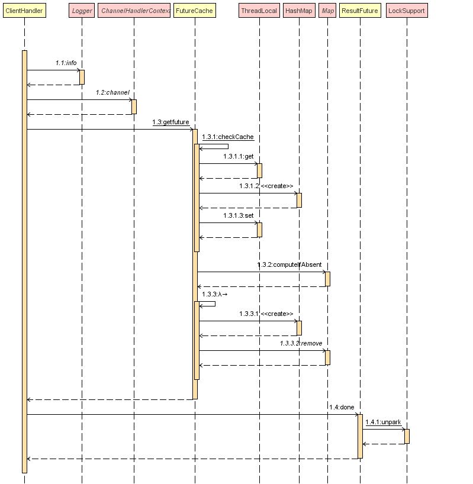

# Rpc-Netty-Registry
RpcClient, RpcServer, HttpServer, SSO, RpcService, based on netty. 基于netty实现的rpc系统，包含一个前置http服务器，rpc后台服务调用具有单点登录和token权限验证
* Http服务端http请求处理和rpc请求构建发送时序图：HttpServerHandlerSequenceDiagram

* Rpc服务端请求处理和响应构建处理时序图：RpcServerResponseSequenceDiagram.png

* Rpc客户端响应处理时序图：RpcClientHandlerSequenceDiagram.png

